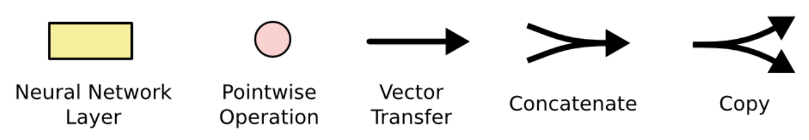

# LSTM: Long Short-Term Memory
Written by: Tamir Offen

## LSTM Architecture:
Credit: https://colah.github.io/posts/2015-08-Understanding-LSTMs/

The following is what a vanilla RNN looks like:

The following is what a vanilla LSTM looks like:
 

## Deep dive into LSTMs:
What allows LSTMs to have long term memory is the `cell state`:

From the diagram we can see that information can just *flow* through the cell state, with only some minor linear interactions. The LSTM has to ability to remove or add information to the cell state through its `gates`:

 

**Steps of LSTM:**

1. Forget Gate: decides what information we'll through away from the cell state. This layer looks at $h_{t-1}$ and $x_t$, outputs a number between 0 and 1, where a 1 represents "completely keep the cell state", and a 0 represents "completely remove/zero out this cell state".

2. Input Gate: first part of the new info that will be added to the cell state. The sigmoid layer decides which values we'll update. The tanh layer creates a new vector of candidate values $\widetilde{C}_t$ that could be added to the state.

3. Update of cell state: we multiply the old state $C_{t-1}$ by $f_t$, forgetting the things the lstm wanted to forget. Then, we add $i_t * \widetilde{C}_t$, the candidate values scaled by how much the lstm decided to update each state value.

4. Output: the output is based on the updated cell state. First, the sigmoid layer will decide what parts of the cell state the lstm is going to output. The lstm then multiplies the output of the sigmoid gate with the cell state through a tanh.

**Example run of a LSTM based language model**:
This language model will try to predict the next word depending on all of the previous ones.

1. The cell state might include the gender of the present subject of the sentence, so that the correct pronouns can be used. When we see a new subject, we want to forget the gender of the old subject.
2. The lstm will want to add the gender of the new subject to the cell state, to replace the old one that it's forgetting.
3. This is where the lstm drops the information about the old subject's gender and adds the new information.
4. Since the model just saw a subject, it might want to output information relevant to a verb, in case that's what is coming next. For example, it might output whether the subject is singular or plural, so that we know what form a verb should be conjugated into if that’s what follows next.

---

## Project: Time Sequence Prediction Using an LSTM
https://youtu.be/AvKSPZ7oyVg?si=-A9FnjgQWoGCOzHD
