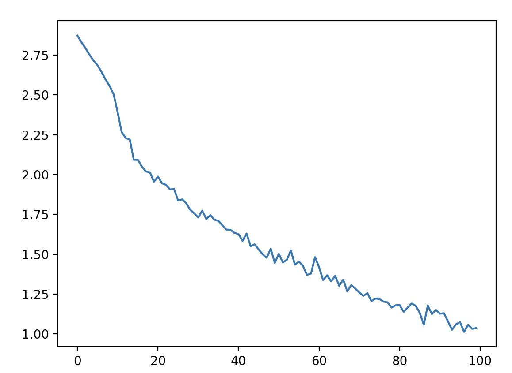
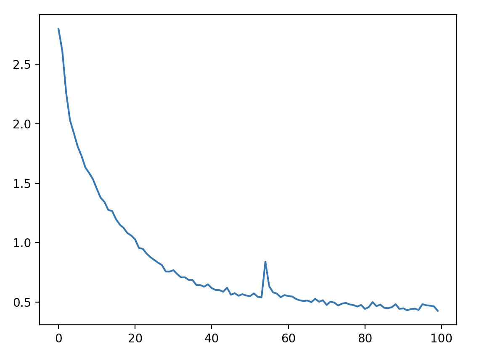

# RNNs - Recurrent Neural Networks
code credit: [Patrick Loeber: PyTorch RNN Tutorial - Name Classification Using A Recurrent Neural Net](https://youtu.be/WEV61GmmPrk?si=l0INF4xULpy-xRar)

written by: Tamir Offen

    If training vanilla neural nets is optimization over functions, training recurrent nets is optimization over programs.

## RNN Architecture:
RNNs are a class of neural networks that allow previous outputs to be used as inputs while having hidden states.


Notice how RNNs allow us to operate over sequences of vectors.

$$
\begin{align*}
h_{t} &\leftarrow \underbrace{\phi}_{\text{non-linearity}}(\underbrace{V \times h_{t-1}}_{\text{prev hidden state}} + \underbrace{U \times x_t}_{\text{current input}}) \\
o_t &\leftarrow W \times h_t
\end{align*}
$$

RNN API:
```python
rnn = RNN()
y = rnn.step(x) # x is an input vector, y is the rnn's output vector
```

Vanilla RNN step implementation:
```python
class RNN:
    # W, U, V ...
    def step(self, x):
        # hidden state update:
        self.h = np.tanh(np.dot(self.V, self.h) + np.dot(self.U, x))
        # compute output vector
        y = np.dot(self.W, self.h)
        return y
        
```

RNN Types:


Each rectangle is a vector and arrows represent functions (e.g. matrix multiply). Input vectors are in red, output vectors are in blue and green vectors hold the RNN's state (more on this soon). From left to right: (1) Vanilla mode of processing without RNN, from fixed-sized input to fixed-sized output (e.g. image classification). (2) Sequence output (e.g. image captioning takes an image and outputs a sentence of words). (3) Sequence input (e.g. sentiment analysis where a given sentence is classified as expressing positive or negative sentiment). (4) Sequence input and sequence output (e.g. Machine Translation: an RNN reads a sentence in English and then outputs a sentence in French). (5) Synced sequence input and output (e.g. video classification where we wish to label each frame of the video). Notice that in every case are no pre-specified constraints on the lengths sequences because the recurrent transformation (green) is fixed and can be applied as many times as we like.

## RNN Pros and Cons:
| Advantage | Drawback |
| --- | --- |
| Can process input of any length | Computation is slow|
| Model size does not change w.r.t. size of input | Difficult to access information from a long time ago|
| Computation takes into account historical information | Cannot consider future input for the current state|
| Model weights are shared across time | |

---

## Project: Last Name Classification Using a RNN
In `/RNN/data` there are a collection of last names from different countries. We want to build a model that will input a last name and will output the origin country. For example, if we pass in the last name "smith", out model should output English.

To test the model, run `rnn_test.py`.

### **Data Preprocessing**:
Our data consists of 18 text files, each filled with names from a specific origin. 

For example: 

    Dutch.txt:
    Aalsburg
    Aalst
    Aarle
    Achteren
    Achthoven

We will use the `utils.py/load_data` function to load our data into a dictionary called category_lines, which will contain a list of names per language.
```python
category_lines, all_categories = load_data()
category_lines['Italian'][:5] = ['Abandonato', 'Abatangelo', 'Abatantuono', 'Abate', 'Abategiovanni']
```

We will train our model by feeding it examples of (last_name, origin). But, in order to do that, we need to represent the training examples in a way that is useful for learning by the RNN.

First we will define our alphabet, or what characters are legal, which will be all lower case, upper case latin letters and " .,;'". In total, (N_LETTERS) 57 legal characters.

We will use the `utils.py/unicode_to_ascii` function to convert any non legal character to a legal character in a given string. For example:
```python
unicode_to_ascii("Ślusàrski") = "Slusarski"
```

NNs work with numbers, so we want to represent each name as a 'number'. First we will think about how to represent a single letter as a 'number'. We can use a technique called one hot encoding, which is a vector of 0s, and a 1 at the index of the letter. In our case, to represent a single letter, our one-hot vector is of size 
<1 x N_LETTERS>. For example: "b" = <0,1,0,...,0>. To generalize this to a word, we can "chain" together each OHE of each letter in the word. Given a word of length n, our encoding of the word will be of shape <n x 1 x N_LETTERS>.
Example: 

```python
tensor([[0., 1., 0., 0., ... 0.]]) #OHE of 'b', shape=(1,57)
tensor([[[1., 0., 0., 0., ... 0.]], #OHE of 'abc'
        [[0., 1., 0., 0., ... 0.]], #shape=(3,1,57)
        [[0., 0., 1., 0., ... 0.]]])
```


### **RNN**:
The architecture of the RNN is as follows:


The implementation can be found in `rnn.py`.

```python
rnn = RNN(input_size, hidden_size, output_size)
```

$\vec{\text{input}} \in (1, \text{input\_size})$

$\vec{\text{hidden}} \in (1, \text{hidden\_size})$

The *combined* block concatenates along dimension 1 of the input and hidden vectors. This means that the resulting concatenated vector will be of shape $(1, \text{input\_size}+\text{hidden\_size})$.

The hidden layer is comprised of a linear layer, effectively i2o and i2h are matrices of shapes $(\text{input\_size}+\text{hidden\_size},\text{output\_size})$ and $(\text{input\_size}+\text{hidden\_size},\text{hidden\_size})$ respectively.

As an example, we will take a `RNN(input_size=5, hidden_size=16, output_size=3)`

The computational graph with tensor sizes are:


### **Training Loop**
We will train a `RNN(input_size=N_LETTERS, hidden_size=n_hidden, output_size=n_categories)` such that N_LETTERS is the number of letters in our alphabet(57), n_hidden we initialized to 128 arbitrarily, and n_categories is the number of country origins (18).

Because we are solving a classification task, we set our loss to be negative log likelihood (cross entropy). The training loop consists of getting a random training example (line, category), training the model on that one example, and repeat. Not all lines (last names) in training examples are of the same length, but this is not a problem for the rnn because we will process each letter in the line, while maintaining the hidden state, and output the model's prediction at the end of processing the full line. 

```python
hidden = rnn.init_hidden()
# line_tensor is the line after OHE it
for i in range(line_tensor.size()[0]):
    output, hidden = rnn(line_tensor[i], hidden)
```

The training is quick, less than 5 minutes on an intel i7, and produces the following graph and output:


output:
```
started training
5000 5 2.698 Kewley | English CORRECT
10000 10 2.547 Kurogane | Scottish WRONG (Japanese)
15000 15 1.513 Doan | Chinese WRONG (Vietnamese)
20000 20 2.031 Doan | Chinese WRONG (Vietnamese)
25000 25 1.601 Buiren | Dutch CORRECT
30000 30 0.873 Natsume | Japanese CORRECT
35000 35 1.325 Cornett | French CORRECT
40000 40 1.113 Chu | Chinese WRONG (Vietnamese)
45000 45 3.623 Samz | German WRONG (Czech)
50000 50 1.271 Abreu | Portuguese CORRECT
55000 55 0.633 Gao | Chinese CORRECT
60000 60 2.306 Chmiel | Czech WRONG (Polish)
65000 65 1.774 Han | Chinese WRONG (Vietnamese)
70000 70 0.489 Ferro | Portuguese CORRECT
75000 75 0.009 Kotsiopoulos | Greek CORRECT
80000 80 0.182 Kimura | Japanese CORRECT
85000 85 0.717 Reijnder | Dutch CORRECT
90000 90 2.276 Piller | English WRONG (Czech)
95000 95 0.548 Pang | Chinese CORRECT
100000 100 0.165 Shamoun | Arabic CORRECT
Finished Training
Saved model to saved_models/rnn_relu.pth
```


If we train it for longer, we get the following graph:

(I think it overfit but further testing required on a test set etc.)

